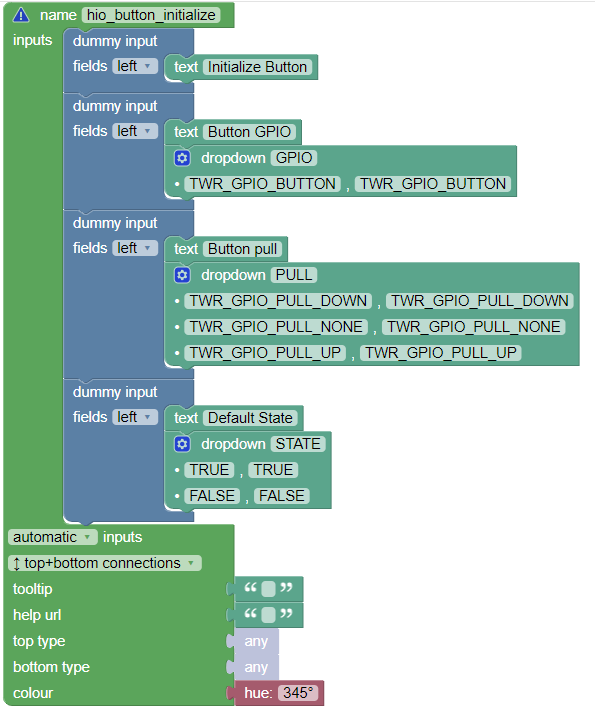

# HARDWARIO TOWER Blockly - IN DEVELOPMENT

Blockly environment for HARDWARIO TOWER IoT Kit.

## Install

To install all the needed packages use:

```
pip install -r requirements.txt
```

## Run

To run the server on your `localhost` use:

```
python manage.py runserver
```

After that, the webpage will be available at `http://127.0.0.1:8000`.

## Update

If you update something in the code, you don't have to restart the server. Just save the changes and reload the page.

## For Developers

If you want to create some new blocks, you can use [**Blockly Developer Tools**](https://blockly-demo.appspot.com/static/demos/blockfactory/index.html#).

### Block naming

While creating new blocks, you should be mindful of our naming conventions.

The block should be named in this format: `hio_MODULE_ACTION`. For example, `hio_button_initialize` MODULE is **Button Module** and action is **Initialization**

If there are any sensors on the module you can use format: `hio_MODULE_SENSOR_ACTION`. For example, `hio_core_tmp112_initialize` is for the initialization of tmp112 sensor on the **Core Module**.

In the case of creating a value block (with the left connection) it should follow the same conventions as above but add the string `_value` at the end. For example `hio_core_tmp112_value` for the measured value on the sensor tmp112 present on the **Core Module**. 

Value Block Example


To correctly add arguments to the block, you should capitalize the name of the argument.

Example of correctly created block

